#  터널 운행 시, 내부 환경 설정 시스템 개발 

프로젝트 참여자: 김도한, 성재현, 이시윤, 전민제, 정성윤

## 목차
- [실행 방법](#실행-방법)
- [System Architecture](#system-architecture)
- [Hardware Architecture](#hardware-architecture)
  - [Hardware Details](#hardware-details)
    - [Raspberry Pi 4](#raspberry-pi-4)
    - [Arduino UNO](#arduino-uno)

### 실행 방법
* Build:  
make

* run:  
sudo ./run

## System Architecture
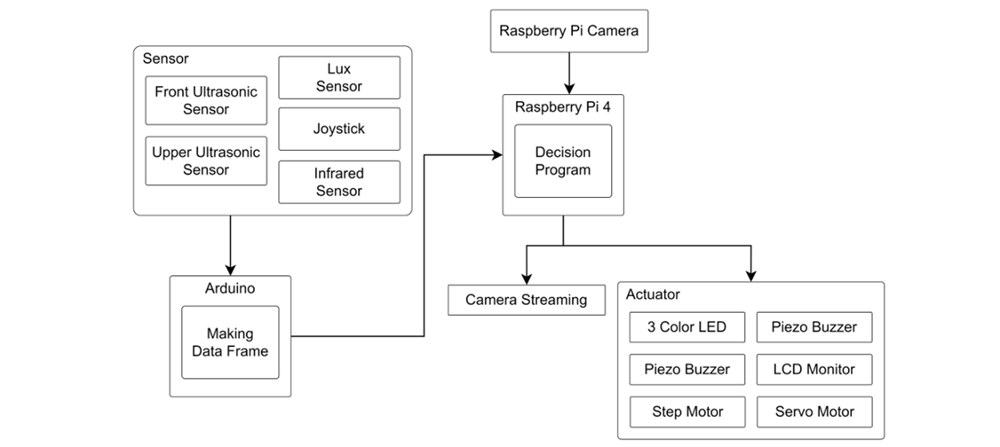  

  
## Hardware Architecture
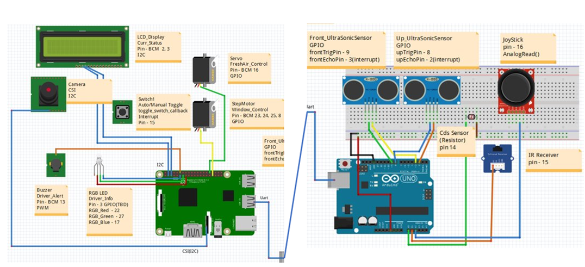  

### Hardware Details
> #### Raspberry Pi 4
> |부품|사진|
> |------|---|
> |Raspberry Pi 4|
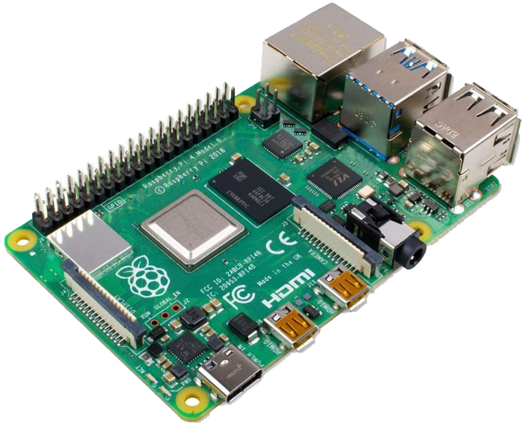
|
> |Raspberry Pi Camera|

|
> |LCD Display|
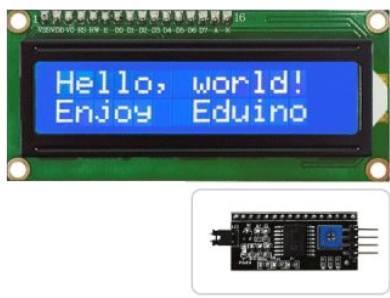
|
> |Servo Motor|
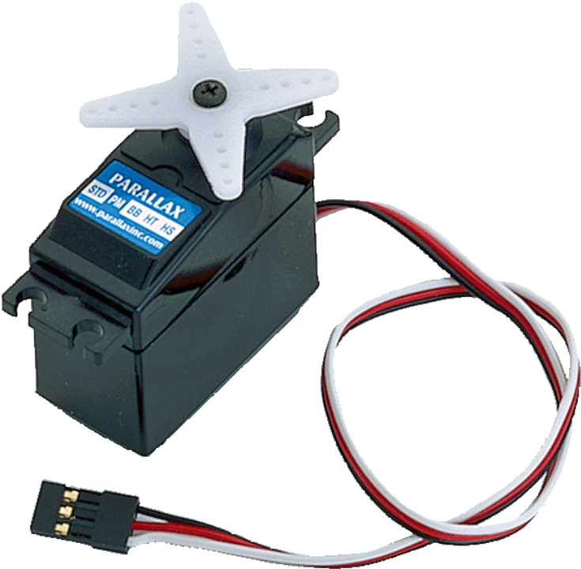
|
> |Step Motor|
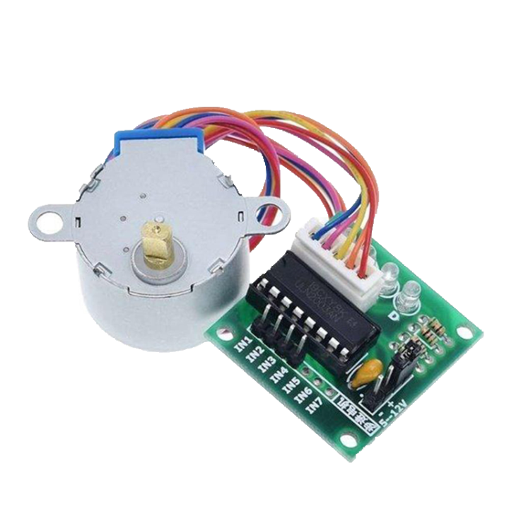
|
> |Piezo Buzzer|
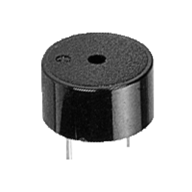
|
> |RGB LED|
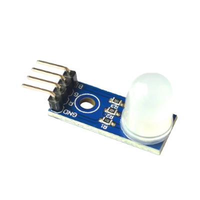
|
> |Button|

|
  
> #### Arduino UNO
> |부품|사진|
> |------|---|
> |Arduino UNO|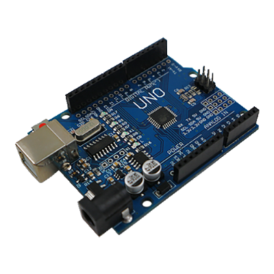|
> |UltraSonic Sensor||
> |JoyStick||
> |CDS Sensor|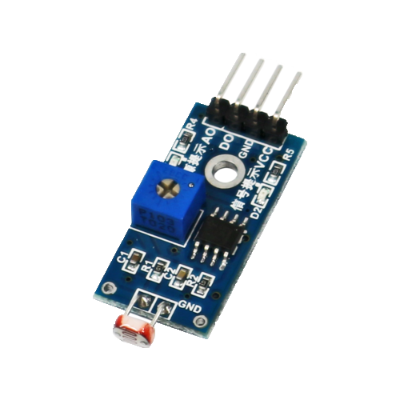|
> |IR Receiver|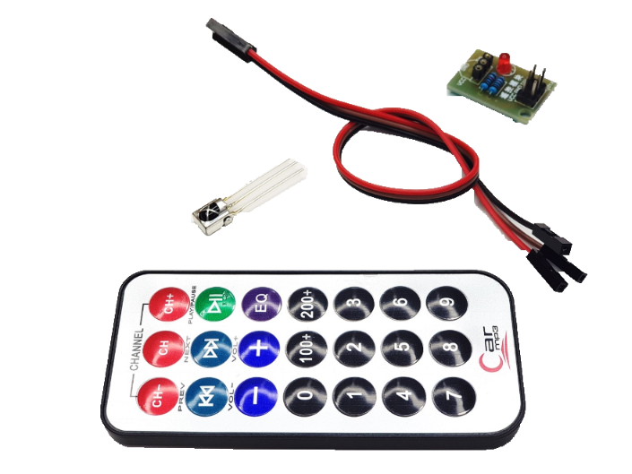|
