#  터널 운행 시, 내부 환경 설정 시스템 개발 

프로젝트 참여자: 김도한, 성재현, 이시윤, 전민제, 정성윤  
프로젝트 기간: 2023년 10월 18일 ~ 2023년 10월 30일

# 목차
- [Software](#software)
- [실행 방법](#실행-방법)
- [System Architecture](#system-architecture)
- [Hardware](#hardware)
  - [Hardware Architecture](#hardware-architecture)
  - [Hardware Details](#hardware-details)

## Software
- **Raspberry Pi OS**
  - [Wiring Pi](https://github.com/WiringPi/WiringPi)
  - make
- **Arduino**
  - Arduino UNO

## 실행 방법
#### Arduino
- 아두이노 프로그램 실행  
  [UNO program](Project1/Total_module.ino) (Project1/Total_module.ino)  

  
#### Raspberry Pi  
- Build:  
  ```
  make
  ```

- run:  
  ```
  sudo ./run`
  ```

## System Architecture
- ### 모사한 차량 전장 System Architecture
  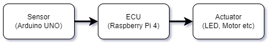  
- ### 개발을 진행한 System Architecture
  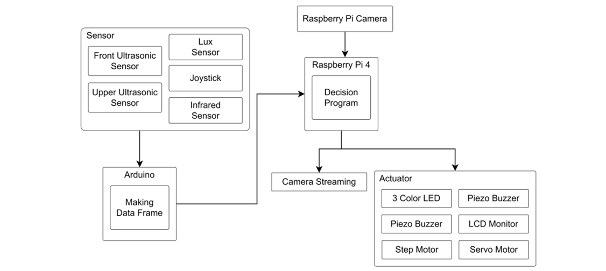  

## Hardware
- ### Hardware Architecture
  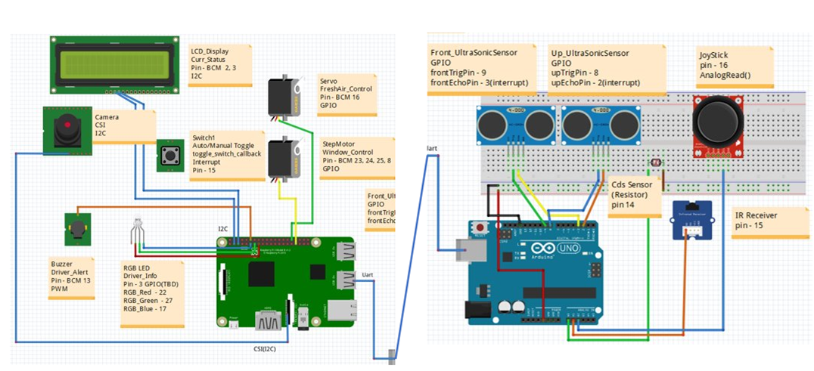  

- ### Hardware Details
  #### Raspberry Pi 4
  |**부품**|**사진**||**부품**|**사진**|
  |:---:|:---:|---|:---:|:---:|
  |Raspberry Pi 4|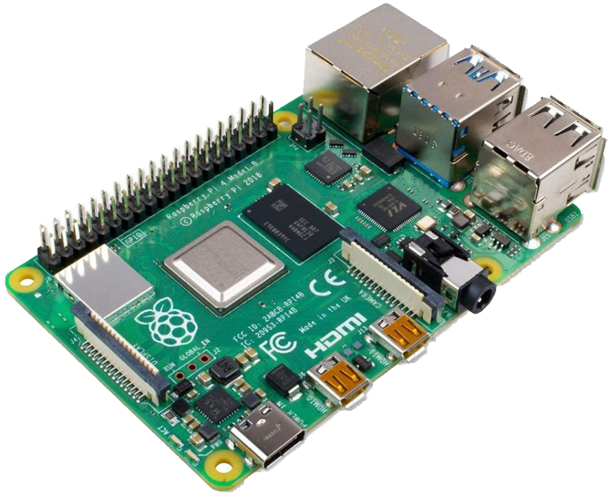||Raspberry Pi Camera<br/>Rev 1.3||
  |LCD Display|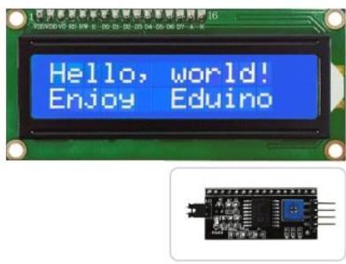||RGB LED|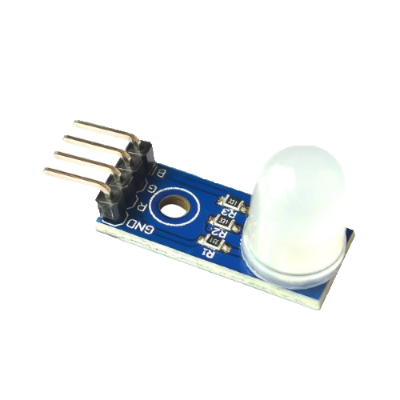|
  |Servo Motor|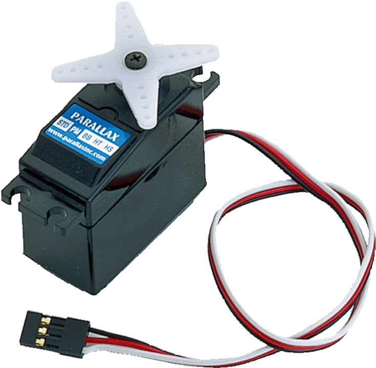||Step Motor|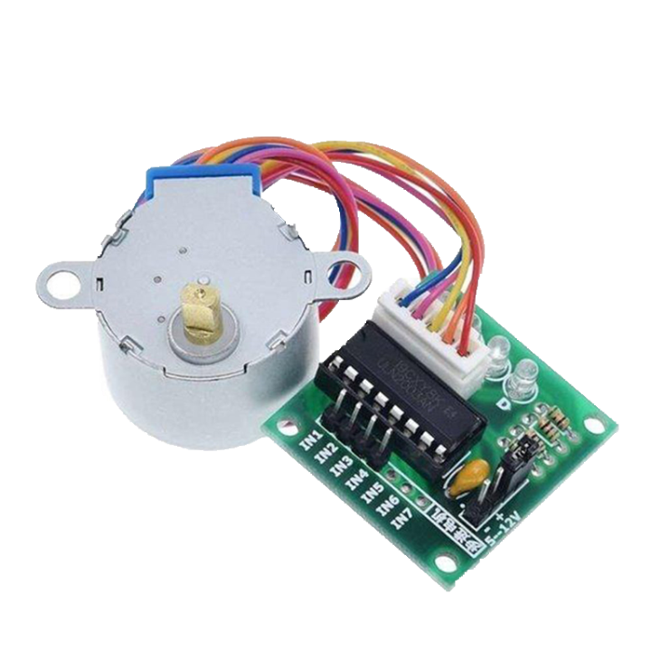|
  |Piezo Buzzer|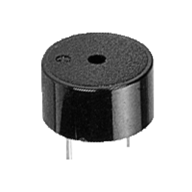||Button|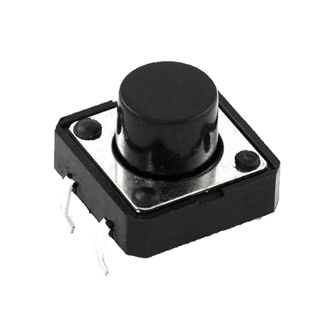|

  #### Arduino UNO
  |**부품**|**사진**||**부품**|**사진**|
  |:---:|:---:|---|:---:|:---:|
  |Arduino UNO|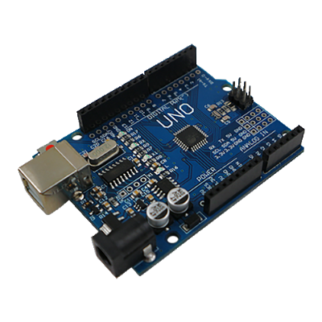||UltraSonic Sensor<br/>(HC-SR04)||
  |CDS Sensor|||IR Receiver<br/>(21 keys)|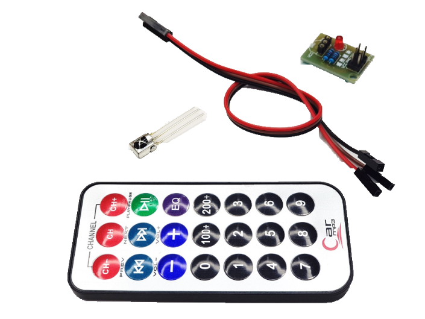|
  |JoyStick<br/>(SZH-EK056)|||||
